# Roadmap Management Tool

## Automation for CE VHST Roadmap Management

**Author:** Mustapha ELKAMILI
**Version:** 1.0.0 | December 2024

---

## Table of Contents

1. [The Challenge](#the-challenge)
2. [The Solution - Python CLI Tool](#the-solution---python-cli-tool)
3. [File Structure](#file-structure)
4. [Key Features](#key-features)
5. [System Architecture](#system-architecture)
6. [Feature Deep Dives](#feature-deep-dives)
7. [Safety Features](#safety-features)
8. [User Personas](#user-personas)
9. [Future Enhancements](#future-enhancements)

---

## The Challenge

### Description

<div align="center">

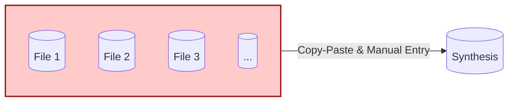

</div>

### Pain Points

| Problem | Impact |
|---------|--------|
| **Manual data collection** | 50+ Excel files to open and copy |
| **Hours of repetitive work** | many hours every time |
| **Risk of human errors** | Inconsistent data, typos |
| **Updating dropdowns manually** | Each file needs individual updates |
| **No version control** | No backup strategy |

---

## The Solution - Python CLI Tool

<div align="center">

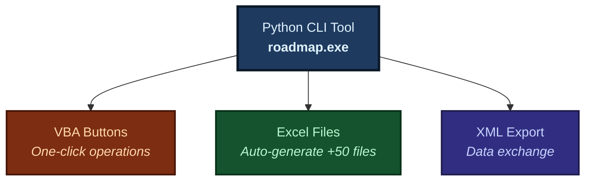

</div>

| Feature | Description |
|---------|-------------|
| **Automated** | No manual intervention needed |
| **Fast** | ~50 files in ~9 seconds (parallel mode) |
| **Reliable** | Consistent results every time |
| **User-friendly** | VBA buttons in Excel |
| **Safe backups** | Auto-archive before changes |
| **Fully logged** | Track all operations |

---

## File Structure

```
base_directory/
│
├── Synthese_RM_CE.xlsm                <── Master file (VBA macros, with accent)
│
├── RM_template.xlsx                   <── Template for new interfaces
│
│
├── collabs.xml                        <── Temp file (VBA creates, Python deletes after reading)
│
├── pointage_output.xml                <── Temp file (Python creates, VBA deletes after reading)
│
├── RM_Collaborateurs/                 <── Collaborator files
│   ├── RM_A.xlsx
│   ├── RM_B.xlsx
│   ├── RM_C.xlsx
│   └── ...
│
├── Archived/                          <── Backup storage
│   └── Archive_RM_*_[timestamp].zip
│
└── Deleted/                           <── Deleted files storage
    └── Deleted_RM_*_[timestamp].zip
```
---

## Key Features

<div align="center">

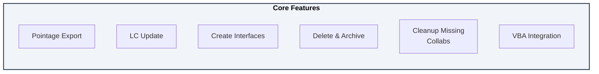

</div>

### Feature Details

| Feature | Description |
|---------|-------------|
| **Pointage Export** | Collect time tracking from all collaborator files and populate 'SYNTHESE' sheet (via temporary XML) |
| **LC Update** | **VBA-only** sync of conditional lists directly from LC sheet to all files (no temporary files) |
| **Create Interfaces** | Auto-generate Excel files from template (via temporary collabs.xml, 2 processing modes: normal/para) |
| **Delete & Archive** | Safe removal with timestamped zip backups |
| **Cleanup Missing** | Remove interface files for collaborators no longer in the list |
| **VBA Integration** | One-click buttons in Excel - seamless Python-VBA communication via temporary files |

---

## System Architecture

### Three-Layer Design

```
┌─────────────────────┐      Shell Calls      ┌─────────────────────┐      Read/Write       ┌─────────────────────┐
│                     │                       │                     │                       │                     │
│    USER LAYER       │ ───────────────────>  │  AUTOMATION LAYER   │ ───────────────────>  │    DATA LAYER       │
│                     │                       │                     │                       │                     │
│  - Create           │                       │  - Python CLI       │                       │  - Synthese.xlsm    │
│  - Delete           │                       │    (roadmap.exe)    │                       │  - Template.xlsx    │
│  - Update           │                       │  - RoadmapManager   │                       │  - RM_Collab/*.xlsx │
│  - Pointage         │                       │  - openpyxl         │                       │  - Synthese.xlsm    │
│  - Cleanup          │                       │                     │                       │  - RM_Collab/*.xlsx │
│                     │                       │                     │                       │  - Temp XML/Excel   │
│                     │                       │                     │                       │    (communication)  │
│   [VBA Buttons]     │                       │   [Python Engine]   │                       │   [File Storage]    │
│                     │                       │                     │                       │                     │
└─────────────────────┘                       └─────────────────────┘                       └─────────────────────┘
                │                                    │
                │                                    │
                └────────── Temp Files ──────────────┘
                    (XML/Excel for communication)
```

### Layer Responsibilities

| Layer | Components | Role |
|-------|------------|------|
| **User** | VBA Buttons | Interface for end users, creates/reads temporary communication files |
| **Automation** | Python CLI, RoadmapManager | Processing engine, reads/writes temporary files for VBA communication |
| **Data** | Excel files | Final storage and output ('SYNTHESE' sheet, RM_*.xlsx files) |
| **Communication** | Temporary XML/Excel files | Intermediate files for Python-VBA data exchange (auto-deleted) |

**Note:** XML files (`pointage_output.xml`, `collabs.xml`) are temporary communication bridges between VBA and Python. Temporary files are automatically created, used, and deleted during operations. The final outputs are Excel files and filled sheets.

---

## Feature Deep Dives

### 'Pointage' Export (Time Tracking)

The system provides two variants for collecting pointage data:

1. **`Btn_Collect_RM_Data()`** - Simple collection: Only collects and imports pointage data (preserves existing interfaces)
2. **`Btn_Collect_RM_Data_Reset()`** - Full reset: Collects data, then deletes and recreates all interfaces

---

#### Simple Pointage Collection (`Btn_Collect_RM_Data`)

**Purpose:** Collect time tracking data from all collaborator Excel files and populate the 'SYNTHESE' sheet **without modifying existing interfaces**.

**Important:** The `pointage_output.xml` file is an intermediate communication file between Python and VBA.

**Key Difference:** This function **only collects data** - it does NOT delete or recreate interface files. Use this when you want to import pointage data while preserving existing collaborator files.

**Complete Cycle:**

```
┌─────────────────────┐                       ┌─────────────────────┐                       ┌─────────────────────┐                       ┌─────────────────────┐
│                     │                       │                     │                       │                     │                       │                     │
│   VBA Button        │                       │   Python CLI        │                       │   Intermediate      │                       │   Final Output      │
│   Clicked           │ ───────────────────>  │   Process           │ ───────────────────>  │   XML File          │ ───────────────────>  │   'SYNTHESE' Sheet  │
│                     │                       │                     │                       │                     │                       │                     │
│  Btn_Collect_RM_    │                       │  - roadmap pointage │                       │  pointage_output.   │                       │  'SYNTHESE' sheet   │
│  Data()             │                       │  - Read POINTAGE    │                       │  xml                │                       │  filled with data   │
│                     │                       │    from all files   │                       │  (temporary)        │                       │  (rows appended)    │
│                     │                       │  - RM_A.xlsx        │                       │                     │                       │                     │
│                     │                       │  - RM_B.xlsx        │                       │                     │                       │                     │
│                     │                       │  - RM_C.xlsx        │                       │                     │                       │                     │
│                     │                       │  - ...              │                       │                     │                       │                     │
│                     │                       │                     │                       │                     │                       │                     │
└─────────────────────┘                       └─────────────────────┘                       └─────────────────────┘                       └─────────────────────┘
                                                       │                                                                                            │
                                                       │                                                                                            │
                                                       └────────────────────────────────────────────────────────────────────────────────────────────┘
                                                                              VBA reads XML and imports into 'SYNTHESE' sheet
                                                                              VBA deletes XML file after import
```

**Step-by-Step Process:**

1. **VBA initiates:** User clicks "Collect Pointage Data" button → VBA shows confirmation dialog
2. **VBA validates:** VBA checks if 'SYNTHESE' sheet exists (operation aborts if missing)
3. **VBA calls Python:** VBA executes `roadmap pointage` command
4. **Python collects:** Python reads POINTAGE sheet from all collaborator files (RM_*.xlsx) in RM_Collaborateurs folder
   - Reads from POINTAGE sheet, starting at row 4
   - Reads columns A through K (11 columns total)
   - Stops when encountering a fully empty row
5. **Python creates intermediate XML:** Python writes data to `pointage_output.xml` (temporary communication file)
   - XML format: `<rows><row><col1>...</col1>...<col11>...</col11></row>...</rows>`
   - Creates empty XML file if no data exists (required for VBA compatibility)
6. **VBA validates:** VBA verifies XML file was created and validates exit code from Python
7. **VBA imports data:** VBA reads `pointage_output.xml` and imports all rows into 'SYNTHESE' sheet
   - Finds next available row in 'SYNTHESE' sheet (starting at row 3)
   - Appends all data rows from XML
   - Tracks number of rows imported
8. **VBA cleans up:** VBA deletes `pointage_output.xml` after successful import
9. **VBA confirms:** VBA shows completion message with number of rows imported

**Complete Workflow:**

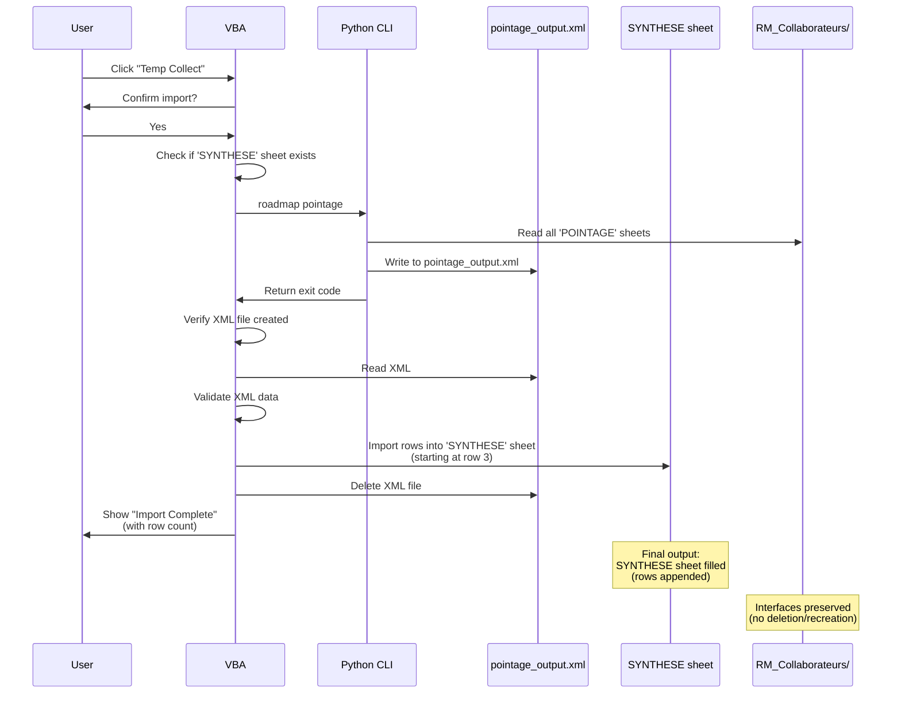

**Error Handling:**
- Validates 'SYNTHESE' sheet exists before proceeding
- Checks Python command exit code for errors
- Verifies XML file was created successfully
- Validates XML data is not corrupted or empty
- Properly manages screen updating and status bar
- Shows informative error messages if any step fails

**Result:** 'SYNTHESE' sheet is populated with pointage data from all collaborator files. Existing interface files remain unchanged.

---

#### Full Pointage Collection with Reset (`Btn_Collect_RM_Data_Reset`)

**Purpose:** Collect time tracking data from all collaborator Excel files, populate the 'SYNTHESE' sheet, **then delete and recreate all interface files**.

**Key Difference:** This function performs a **complete reset** - it collects data, then deletes all existing interfaces and creates fresh ones. Use this when you want to start with clean interface files.

**Complete Workflow:**

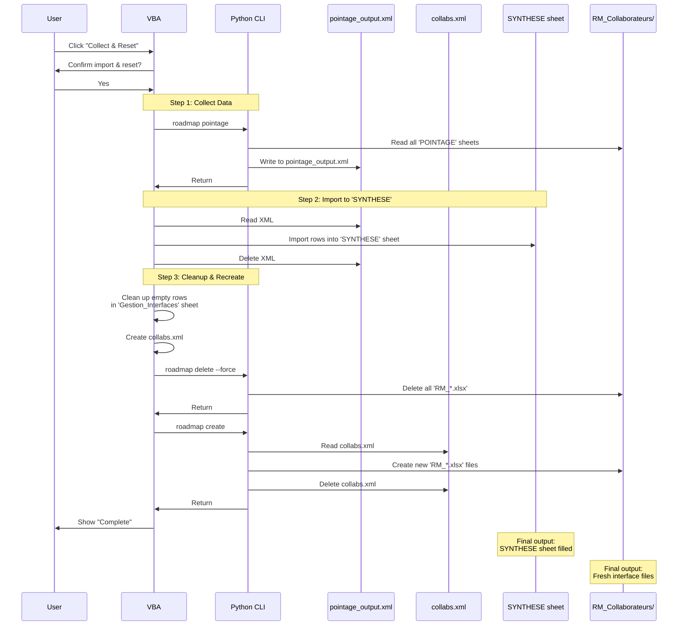

**Step-by-Step Process:**

1. **VBA initiates:** User clicks "Collect Pointage & Reset" button → VBA shows confirmation dialog
2. **VBA validates:** VBA checks if 'SYNTHESE' sheet exists
3. **Step 1 - Collect Data:** Same as simple collection (steps 3-8 above)
4. **Step 2 - Cleanup:** VBA removes empty rows from 'Gestion_Interfaces' sheet
5. **Step 3 - Create XML:** VBA creates `collabs.xml` with current collaborator list
6. **Step 4 - Delete Interfaces:** VBA calls `roadmap delete --force` to remove all existing interface files
7. **Step 5 - Create Interfaces:** VBA calls `roadmap create` to generate fresh interface files from template
8. **VBA confirms:** VBA shows completion messages for each step

**Result:** 'SYNTHESE' sheet is populated with pointage data, and all interface files are replaced with fresh copies from the template.

---

### LC (Conditional Lists) Update

**Purpose:** Synchronize conditional list (LC) across template and all collaborator files.

**Important:** LC Update is now **fully implemented in VBA** - no Python CLI or temporary files required. All processing happens directly in Excel.

**Complete Cycle:**

```
┌─────────────────────┐                       ┌─────────────────────┐                       ┌─────────────────────┐
│                     │                       │                     │                       │                     │
│   VBA Button        │                       │   VBA Reads         │                       │   VBA Updates       │
│   Clicked           │ ───────────────────>  │   LC Sheet          │ ───────────────────>  │   All Excel Files   │
│                     │                       │                     │                       │                     │
│  Btn_Update_LC()    │                       │  - Read LC sheet    │                       │  - RM_template.xlsx │
│                     │                       │    from Synthese    │                       │  - RM_A.xlsx        │
│                     │                       │  - Columns B-I      │                       │  - RM_B.xlsx        │
│                     │                       │  - Starting row 2   │                       │  - ...              │
│                     │                       │                     │                       │                     │
└─────────────────────┘                       └─────────────────────┘                       └─────────────────────┘
```

**Step-by-Step Process:**

1. **VBA initiates:** User clicks "Update LC" button → VBA shows confirmation dialog
2. **VBA validates:** VBA checks if `LC` sheet exists in current workbook
3. **VBA reads LC sheet:** VBA reads the LC sheet directly from `Synthèse_RM_CE.xlsm` (columns B-I, starting at row 2)
4. **VBA collects files:** VBA collects all target files (template + all RM_*.xlsx files)
5. **VBA processes files:** For each file:
   - Opens workbook (window hidden to prevent flashing)
   - Clears existing LC data (columns B-I from row 2)
   - Sets text format to prevent date/number conversion
   - Copies LC data using optimized Copy/PasteSpecial
   - Makes window visible before closing
   - Saves and closes file
6. **VBA shows progress:** Status bar shows "Updating LC: X of Y files..."
7. **VBA confirms:** VBA shows completion message with file count and time taken

**Complete Workflow**:

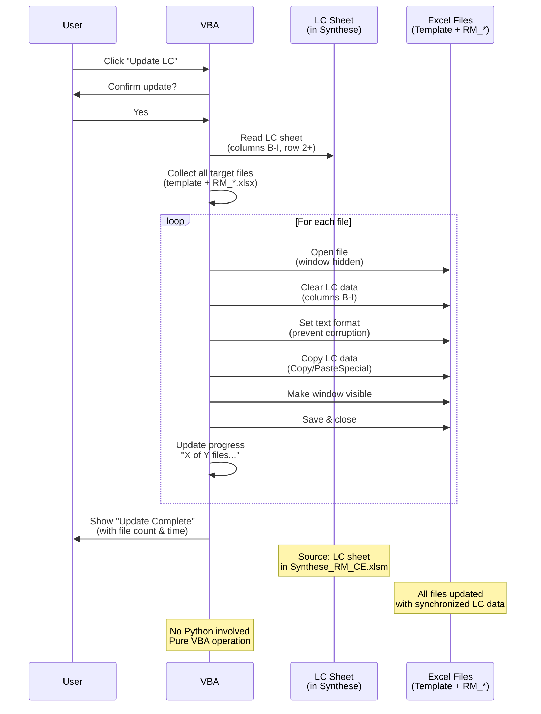

**Key Features:**
- **No temporary files:** Reads directly from LC sheet in Synthese workbook
- **No Python dependency:** Fully implemented in VBA
- **Performance optimized:** Uses Copy/PasteSpecial for bulk operations
- **Text format preservation:** Prevents date/number conversion corruption
- **Progress tracking:** Shows file count and completion time
- **Window management:** Hides windows during processing, ensures visibility before closing
- **Calculation disabled:** Speeds up processing by disabling Excel calculation

**Performance:**
- Processes 20+ files efficiently
- Shows completion time in success message
- Status bar updates show progress

**Result:** All Excel files have synchronized LC data. No temporary files are created or deleted. Operation is faster and more reliable than the previous Python-based approach.

---

### Interface Creation

**Purpose:** Automatically generate individual Excel interface files for each collaborator from the template.

**Important:** The `collabs.xml` file is an intermediate communication file created by VBA and read by Python.

**Complete Cycle:**

```
┌─────────────────────┐                       ┌─────────────────────┐                       ┌──────────────────────┐                       ┌──────────────────────┐
│                     │                       │                     │                       │                      │                       │                      │
│   VBA Button        │                       │   VBA Creates       │                       │   Python Reads       │                       │   Python Creates     │
│   Clicked           │ ───────────────────>  │   Temporary File    │ ───────────────────>  │   Temporary File     │ ───────────────────>  │   Excel Files        │
│                     │                       │                     │                       │                      │                       │                      │
│  Btn_Create_RM()    │                       │  - Read Gestion_    │                       │  - roadmap create    │                       │  - RM_A.xlsx         │
│                     │                       │    Interfaces sheet │                       │  - Read collabs.xml  │                       │  - RM_B.xlsx         │
│                     │                       │  - Create collabs.  │                       │  - Delete collabs.   │                       │  - RM_C.xlsx         │
│                     │                       │    xml (temp)       │                       │    xml               │                       │  - ...               │
│                     │                       │                     │                       │                      │                       │                      │
└─────────────────────┘                       └─────────────────────┘                       └──────────────────────┘                       └──────────────────────┘
```

**Step-by-Step Process:**

1. **VBA initiates:** User clicks "Create Interfaces" button
2. **VBA reads collaborator list:** VBA reads Gestion_Interfaces sheet (column B, starting at row 3)
3. **VBA creates temporary file:** VBA creates `collabs.xml` file with collaborator names (temporary communication file)
4. **VBA calls Python:** VBA executes `roadmap create` command
5. **Python reads temporary file:** Python reads `collabs.xml` to get collaborator list
6. **Python creates files:** Python creates RM_*.xlsx files in RM_Collaborateurs folder:
   - Copies from RM_template.xlsx
   - Sets collaborator name in cell B1 of POINTAGE sheet
   - Adds data validation lists automatically
7. **Python cleans up:** Python deletes `collabs.xml` after reading
8. **VBA confirms:** VBA shows "Creation Complete" message

9. **Complete Workflow**:

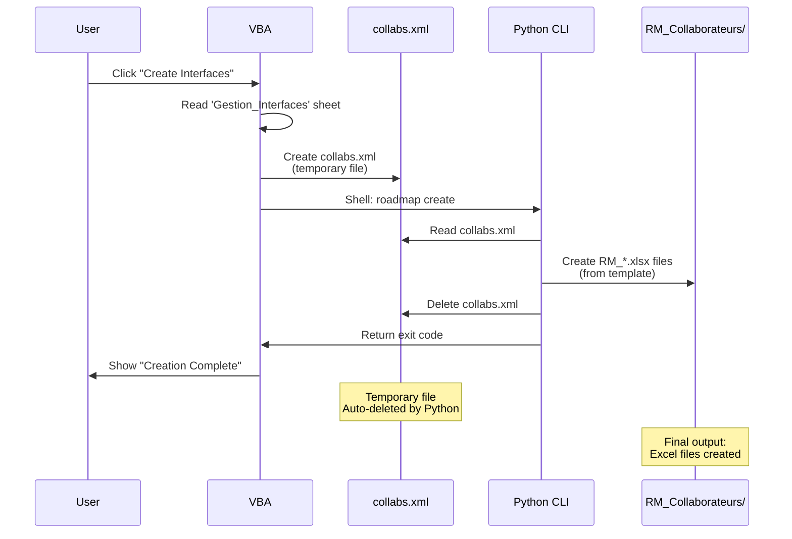

**Performance Comparison (50 files):**

```
Normal (openpyxl sequential)      ████████████████████████████████████  ~55s
Parallel (openpyxl, 8 workers)    ████████                              ~10s

Parallel mode is 5.5x faster than normal mode
```

**Key Features:**
- Only creates files that don't already exist (safe to run multiple times)
- Sets collaborator name in cell B1 of POINTAGE sheet
- Adds data validation lists automatically
- Template file must be closed before running

---

### Delete & Archive Interfaces

**Purpose:** Safely remove all collaborator interface files with optional archiving before deletion.

**Complete Cycle:**

```
┌─────────────────────┐                       ┌─────────────────────┐                       ┌─────────────────────┐                       ┌─────────────────────┐
│                     │                       │                     │                       │                     │                       │                     │
│   VBA Button        │                       │   VBA Calls         │                       │   Python Archives   │                       │   Python Deletes    │
│   Clicked           │ ───────────────────>  │   Python CLI        │ ───────────────────>  │   (if requested)    │ ───────────────────>  │   RM_Collabs        │
│                     │                       │                     │                       │                     │                       │                     │
│  Btn_Delete_RM()    │                       │  - roadmap delete   │                       │  - Create zip in    │                       │  - Create zip in    │
│                     │                       │  - --force flag     │                       │    Archived/        │                       │    Deleted/         │
│                     │                       │  - --archive flag   │                       │  - Archive_RM_*     │                       │  - Deleted_RM_*     │
│                     │                       │    (optional)       │                       │    [timestamp].zip  │                       │    [timestamp].zip  │
│                     │                       │                     │                       │                     │                       │  - Remove folder    │
│                     │                       │                     │                       │                     │                       │                     │
└─────────────────────┘                       └─────────────────────┘                       └─────────────────────┘                       └─────────────────────┘
```

**Step-by-Step Process:**

1. **VBA initiates:** User clicks "Delete" button
2. **VBA confirms force deletion:** VBA shows confirmation dialog requiring user to confirm deletion
3. **VBA asks about archiving:** VBA prompts user whether to archive before deletion
4. **VBA calls Python:** VBA executes `roadmap delete --force` (with optional `--archive` flag)
5. **Python validates:** Python checks if `--force` flag is present (safety mechanism, operation aborts without it)
6. **Python archives (if requested):** If `--archive` flag is set:
   - Creates zip archive: `Archived/Archive_RM_Collaborateurs_[timestamp].zip`
   - Contains all files from RM_Collaborateurs folder
7. **Python deletes:** Python always creates zip archive in Deleted folder:
   - Creates zip archive: `Deleted/Deleted_RM_Collaborateurs_[timestamp].zip`
   - Removes the entire RM_Collaborateurs folder
8. **VBA confirms:** VBA shows completion message

9. **Complete Workflow**:

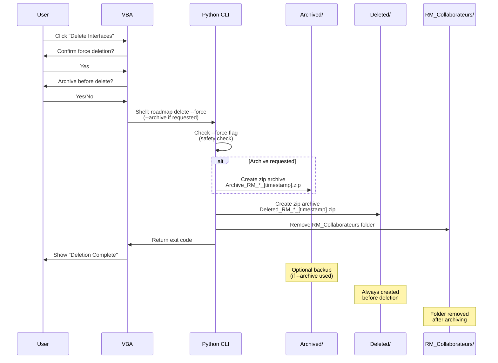

**Archive Structure:**
- **If `--archive` is used:** Creates backup in `Archived/` folder first
- **Always creates:** Zip archive in `Deleted/` folder with timestamp
- **Timestamp format:** `DDMMYYYY_HHMMSS` (e.g., `25122024_143052`)

**Safety Features:**
- **`--force` flag required:** Prevents accidental deletion - operation aborts without this flag
- **Double confirmation:** VBA requires user confirmation before proceeding
- **Automatic archiving:** Always creates zip backup in Deleted folder before removal
- **Optional archive:** User can choose to also archive to Archived folder for extra safety

**Result:** All collaborator interface files are safely removed. Zip archives are created for recovery if needed. The RM_Collaborateurs folder is completely removed.

---

### Cleanup Missing Collaborators

**Purpose:** Remove interface files for collaborators that are no longer in the current collaborator list.

**Important:** The `collabs.xml` file is an intermediate communication file created by VBA and read by Python.

**Complete Cycle:**

```
┌─────────────────────┐                       ┌─────────────────────┐                       ┌─────────────────────┐                       ┌─────────────────────┐
│                     │                       │                     │                       │                     │                       │                     │
│   VBA Button        │                       │   VBA Creates       │                       │   Python Compares   │                       │   Python Deletes    │
│   Clicked           │ ───────────────────>  │   Temporary File    │ ───────────────────>  │   Files vs XML      │ ───────────────────>  │   Orphaned Files    │
│                     │                       │                     │                       │                     │                       │                     │
│  Btn_Cleanup_RM()   │                       │  - Read Gestion_    │                       │  - roadmap cleanup  │                       │  - Create zip in    │
│                     │                       │    Interfaces sheet │                       │  - Read collabs.xml │                       │    Deleted/         │
│                     │                       │  - Create collabs.  │                       │  - Compare files    │                       │  - Deleted_Missing_ │
│                     │                       │    xml (temp)       │                       │    with XML list    │                       │    RM_*[timestamp]  │
│                     │                       │                     │                       │  - Delete collabs.  │                       │  - Remove files     │
│                     │                       │                     │                       │    xml              │                       │                     │
│                     │                       │                     │                       │                     │                       │                     │
└─────────────────────┘                       └─────────────────────┘                       └─────────────────────┘                       └─────────────────────┘
```

**Step-by-Step Process:**

1. **VBA initiates:** User clicks "Remove Interfaces" button
2. **VBA cleans up sheet:** VBA removes empty rows from Gestion_Interfaces sheet
3. **VBA reads collaborator list:** VBA reads Gestion_Interfaces sheet (column B, starting at row 3)
4. **VBA creates temporary file:** VBA creates `collabs.xml` file with current collaborator names
5. **VBA calls Python:** VBA executes `roadmap cleanup` command
6. **Python reads temporary file:** Python reads `collabs.xml` to get current collaborator list
7. **Python compares files:** Python compares existing files in RM_Collaborateurs folder with XML list:
   - Expected files: `RM_{collaborator}.xlsx` for each collaborator in XML
   - Existing files: All `.xlsx` files in RM_Collaborateurs folder (skips temporary files starting with `~$`)
   - Orphaned files: Files that exist but don't match any collaborator in XML list
8. **Python archives orphaned files:** Python creates zip archive before deletion:
   - Creates zip archive: `Deleted/Deleted_Missing_RM_collaborators_[timestamp].zip`
   - Contains all orphaned files
9. **Python deletes orphaned files:** Python removes files that don't match current collaborator list
10. **Python cleans up:** Python deletes `collabs.xml` after reading
11. **VBA confirms:** VBA shows completion message

12. **Complete Workflow**:

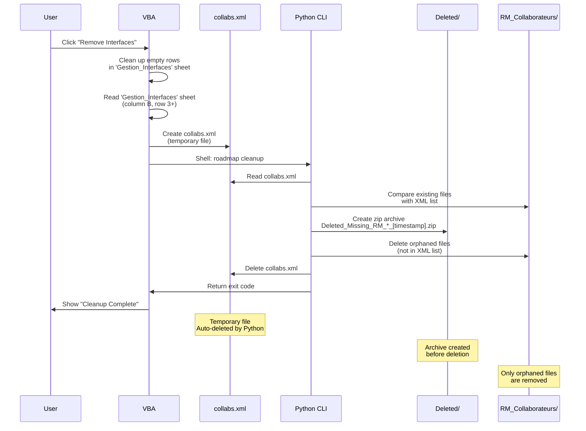

**What Gets Deleted:**
- Only files for collaborators **not** in the current XML list ( 'Gestion_Interfaces' collab list)
- Files that match current collaborators are **preserved**
- Temporary Excel files (starting with `~$`) are **skipped**

**Result:** Files for current collaborators remain intact. Zip archive is created for recovery if needed.

---

### Clear 'SYNTHESE' Sheet

**Purpose:** Archive the 'SYNTHESE' and 'LC' sheets to a timestamped Excel file, then clear the 'SYNTHESE' sheet for new data entry.

**Note:** This is a **VBA-only operation** - no Python CLI involvement. All processing happens within Excel.

**Complete Process:**

```
┌─────────────────────┐                       ┌─────────────────────┐                       ┌─────────────────────┐                       ┌─────────────────────┐
│                     │                       │                     │                       │                     │                       │                     │
│   VBA Button        │                       │   VBA Creates       │                       │   VBA Archives      │                       │   VBA Clears        │
│   Clicked           │ ───────────────────>  │   New Workbook      │ ───────────────────>  │   to Excel File     │ ───────────────────>  │   'SYNTHESE' Sheet  │
│                     │                       │                     │                       │                     │                       │                     │
│  Btn_Clear_Synthese │                       │  - Copy 'SYNTHESE'  │                       │  - Save to          │                       │  - Clear rows 3+    │
│  ()                 │                       │    sheet            │                       │    Archived/        │                       │  - Preserve headers │
│                     │                       │  - Copy LC sheet    │                       │  - Archive_SYNTHESE │                       │                     │
│                     │                       │  - Remove shapes    │                       │   _[timestamp].xlsx │                       │                     │
│                     │                       │  - Remove buttons   │                       │                     │                       │                     │
│                     │                       │                     │                       │                     │                       │                     │
└─────────────────────┘                       └─────────────────────┘                       └─────────────────────┘                       └─────────────────────┘
```

**Step-by-Step Process:**

1. **VBA initiates:** User clicks "Clear SYNTHESE" button
2. **VBA confirms:** VBA shows confirmation dialog asking user to proceed with archiving
3. **VBA checks sheets:** VBA verifies 'SYNTHESE' and LC sheets exist
4. **VBA determines data:** VBA checks if 'SYNTHESE' sheet has data (rows >= 3)
5. **VBA creates new workbook:** VBA creates a new Excel workbook
6. **VBA copies sheets:** VBA copies 'SYNTHESE' and LC sheets to new workbook with all formatting:
   - 'SYNTHESE' sheet copied first
   - LC sheet copied second
   - All cell formatting, formulas, and data preserved
7. **VBA removes interactive elements:** VBA removes from copied sheets:
   - All shapes (buttons, rectangles, etc.)
   - All OLEObjects (ActiveX controls)
   - This removes macro assignments and interactive elements
8. **VBA cleans workbook:** VBA deletes all default sheets (Sheet1, etc.)
9. **VBA saves archive:** VBA saves new workbook as:
   - `Archived/Archive_SYNTHESE_[timestamp].xlsx`
   - Timestamp format: `DDMMYYYY_HHMMSS`
10. **VBA closes archive:** VBA closes the archive workbook
11. **VBA clears 'SYNTHESE':** If 'SYNTHESE' sheet had data:
    - Clears contents from row 3 to last row with data
    - Preserves header rows (rows 1-2)
    - Sheet structure and formatting remain intact
12. **VBA confirms:** VBA shows completion message with archive file path

13. **Complete Workflow**:

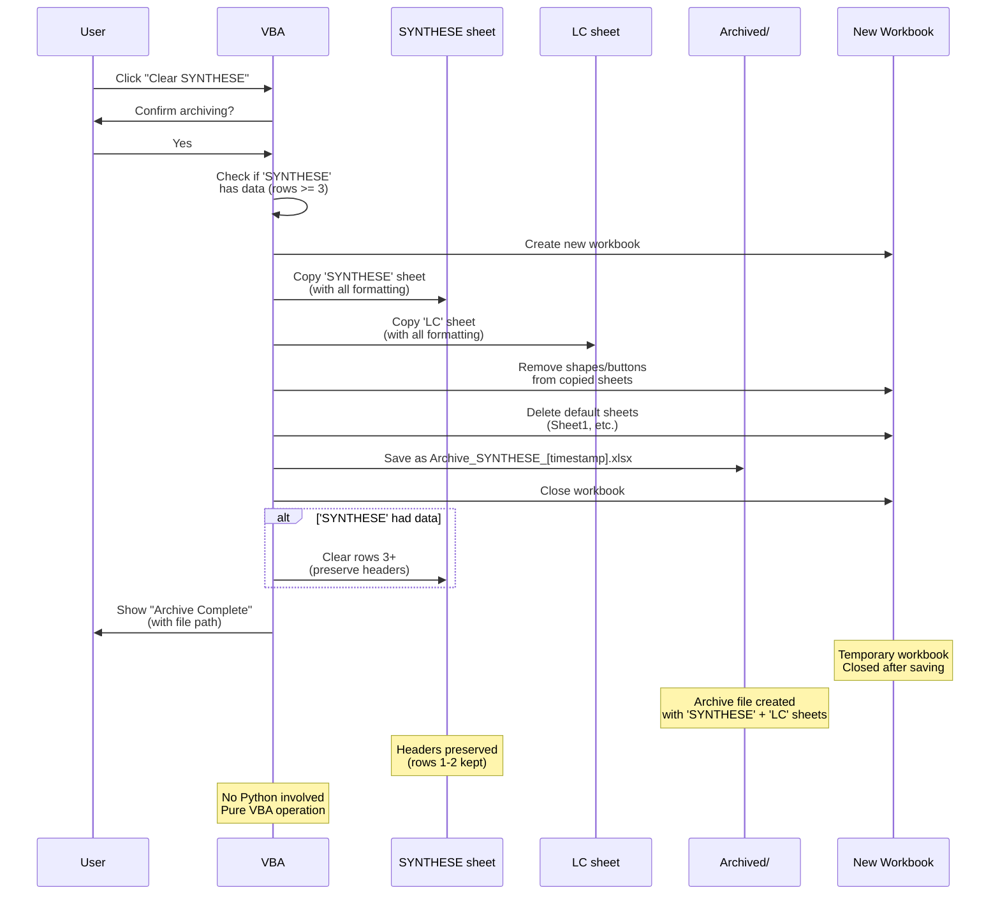

**Archive File Contents:**
- **'SYNTHESE' sheet:** Complete copy with all data and formatting (no buttons/shapes)
- **LC sheet:** Complete copy with all data and formatting (no buttons/shapes)
- **No macros:** Archive file is a standard `.xlsx` file (no VBA code)
- **Clean structure:** Only contains 'SYNTHESE' and 'LC' sheets

**Result:** 'SYNTHESE' and 'LC' sheets are archived to a timestamped Excel file. 'SYNTHESE' sheet is cleared (rows 3+) while preserving headers. Archive file is saved in Archived folder for historical reference.

---

### Python-VBA Communication Architecture

The system uses **temporary XML/Excel files** as communication bridges between Python and VBA. These files are automatically created, used, and deleted during operations.

**Key Principle:** XML files (`pointage_output.xml`, `collabs.xml`) are **intermediate communication files**. They enable data exchange between Python (CLI) and VBA (Excel macros) where needed. LC update is now fully VBA-based and requires no temporary files.

#### Communication Flow Overview

The system uses three types of temporary files to enable communication between VBA and Python. Below are the complete flows:

**Flow 1: VBA → Python (Create Interfaces / Update LC)**

*Sequence: User clicks → VBA reads sheet → VBA creates temp file → Python reads → Python processes → Python deletes temp file*

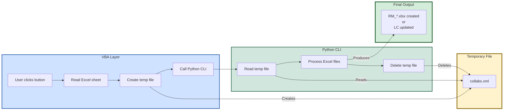

**Flow 2: Python → VBA (Pointage Collection)**

*Sequence: User clicks → Python reads files → Python processes → Python creates temp file → VBA reads → VBA imports → VBA deletes temp file*

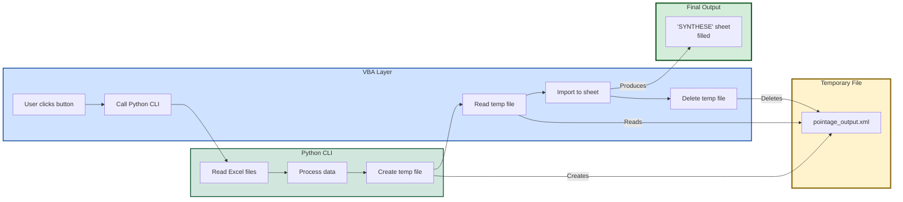

**Summary Table:**

| Temporary File | Created By | Read By | Deleted By | Used For |
|----------------|------------|---------|------------|----------|
| `collabs.xml` | VBA | Python | Python | Pass collaborator list to create interfaces |
| `pointage_output.xml` | Python | VBA | VBA | Pass pointage data to fill 'SYNTHESE' sheet |

**Key Points:**
- Temporary files are **automatically created** during operations (except LC update, which is now VBA-only)
- They serve as **communication bridges** between VBA and Python
- They are **automatically deleted** after use (no manual cleanup needed)
- Final outputs are **Excel files and filled sheets**, not XML files
- **LC Update exception:** No temporary files needed - reads directly from LC sheet in Synthese workbook

---

## Safety Features

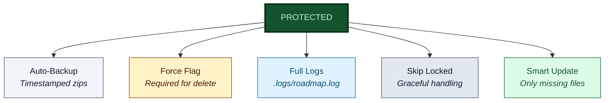

### Safety Mechanisms

| Feature | Description |
|---------|-------------|
| **Auto-archive** | Timestamped zip before any deletion |
| **--force flag** | Required for destructive operations |
| **Comprehensive logging** | All operations logged to `.logs/roadmap.log` |
| **Create only MISSING** | Never overwrites existing files - safe to run multiple times |
| **Temporary file handling** | Uses temp files for safe updates even if files are open |
| **Temp file cleanup** | Temporary files (collabs.xml) automatically deleted after use |
---

## User Personas

| Persona | Role | Interaction |
|---------|------|-------------|
| **Admin** | System administrator | Runs all operations via VBA buttons |
| **Power User** | Technical user | Uses CLI directly for automation |
| **Collaborator** | End user | Only fills data in their own file |

---

## Future Enhancements

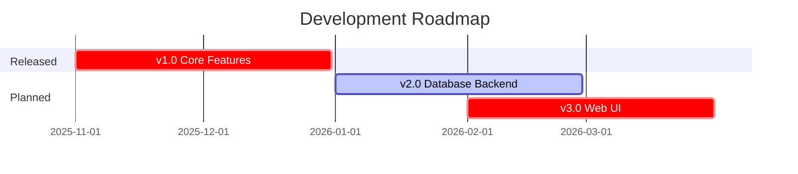
---